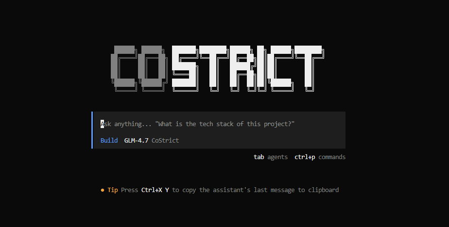

<p align="center">
  <a href="https://costrict.ai">
    
  </a>
</p>
<p align="center">The open source AI coding agent based on opencode with costrict-specific optimizations.</p>
<p align="center">
  <a href="https://www.npmjs.com/package/@costrict/cs"></a>
</p>

[](https://costrict.ai)

---

### Installation

```bash
npm i -g @costrict/cs@latest
```

> [!TIP]
> Remove versions older than 2.x before installing.

### Agents

CoStrict includes two built-in agents you can switch between with the `Tab` key.

- **build** - Default, full-access agent for development work
- **plan** - Read-only agent for analysis and code exploration
  - Denies file edits by default
  - Asks permission before running bash commands
  - Ideal for exploring unfamiliar codebases or planning changes

Also included is a **general** subagent for complex searches and multistep tasks.
This is used internally and can be invoked using `@general` in messages.

#### CoStrict Specialized Agents

CoStrict's agent system includes 11 specialized agents for different tasks:

- **WikiProjectAnalyze** - Project classification analysis
- **WikiCatalogueDesign** - Document structure design
- **WikiDocumentGenerate** - Document generation
- **WikiIndexGeneration** - Index file generation
- **Coding** - Coding agent
- **FixAgent** - Fix agent
- **QuickExplore** - Quick exploration
- **StrictPlan** - Strict planning
- **SubCoding** - Sub-coding
- **TaskCheck** - Task checking
- **TDD** - Test-driven development

Learn more about [agents](https://docs.costrict.ai/cli/category/product-features).

### CoStrict-Specific Optimizations

CoStrict provides several optimizations on top of the base agent system to improve development efficiency and stability.

#### AI Provider Optimizations

- **CoStrict Provider**: Custom AI model provider supporting multiple model integrations
- **Automatic Token Refresh**: Proactive token refresh and 401 error recovery to ensure session continuity
- **Dynamic Model List**: Real-time fetching of available models from API, no manual configuration updates needed

#### Advanced Tool System

CoStrict provides a suite of advanced tools for automating complex tasks:

- **sequential-thinking**: Structured thinking tool supporting dynamic step count adjustment, thought revision, and branch creation for step-by-step analysis of complex problems
- **call-graph**: Call graph analysis tool that analyzes function call relationships and symbol resolution to help understand code structure
- **file-importance**: File importance analysis tool that evaluates file importance across multiple dimensions to optimize code review and refactoring decisions
- **file-outline**: File structure extraction tool that extracts class, function, method definitions, and docstrings for quick understanding of code organization
- **checkpoint**: Git checkpoint tool for creating, viewing, and restoring checkpoints to support safe experimentation and state recovery

#### Specialized Agent System

CoStrict includes 11 specialized agents covering various development scenarios:

- **Wiki Generation Agents**: Automatically generate project technical documentation, including architecture descriptions, API documentation, etc.
- **TDD Agent**: Test-driven development support, automatically generating test cases and validating code
- **QuickExplore Agent**: Fast project exploration and code understanding to help quickly get started with new projects
- Other specialized agents cover code review, performance optimization, security checks, and more

#### Enhanced Error Handling

- **Intelligent Error Recognition**: Automatically identifies common error types like 503, 429
- **Automatic Retry**: Supports automatic retry for 503, 429, connection errors, etc., improving task success rate
- **Output Length Limit**: Automatically handles output length limit errors to ensure complete responses

### Documentation

For more info on how to configure CoStrict, visit our [official documentation](https://docs.costrict.ai/cli/guide/introduction) or [**head over to our docs**](https://costrict.ai/docs).

### Building on CoStrict

If you are working on a project that's related to CoStrict and is using "costrict" as part of its name, for example "costrict-dashboard" or "costrict-mobile", please add a note to your README to clarify that it is not built by the CoStrict team and is not affiliated with us in any way.

### FAQ

#### How is this different from OpenCode?

It's very similar to OpenCode in terms of capability. Here are the key differences:

- **AI Provider**: CoStrict Provider supports automatic token refresh and 401 error recovery
- **Tool System**: 5 advanced tools (sequential-thinking, call-graph, file-importance, file-outline, checkpoint)
- **Agent System**: Expanded from 4 to 11 specialized agents
- **Error Handling**: Intelligent recognition and automatic retry for 503, 429 errors
- **Plugin System**: @costrict/notify plugin and notification intervention system
- **Deployment Support**: Optimized Dockerfile and multi-platform NPM image sync
- **Documentation System**: Automatic project technical documentation and indexing

#### How is this different from Claude Code?

It's very similar to Claude Code in terms of capability. Here are the key differences:

- 100% open source
- Not coupled to any provider. Although we recommend [CoStrict Pricing Plans](https://costrict.ai/pricing), CoStrict can be used with Claude, OpenAI, Google, or even local models. As models evolve, the gaps between them will close and pricing will drop, so being provider-agnostic is important.
- Out-of-the-box LSP support
- A focus on TUI. CoStrict is built by neovim users and the creators of [terminal.shop](https://terminal.shop); we are going to push the limits of what's possible in the terminal.
- A client/server architecture. This, for example, can allow CoStrict to run on your computer while you drive it remotely from a mobile app, meaning that the TUI frontend is just one of the possible clients.
- **CoStrict-specific optimizations**: Advanced tool system, specialized agents, intelligent error handling

---

### Community Communication & Feedback

<p align="center">
  
  &nbsp;&nbsp;&nbsp;&nbsp;
  
</p>
