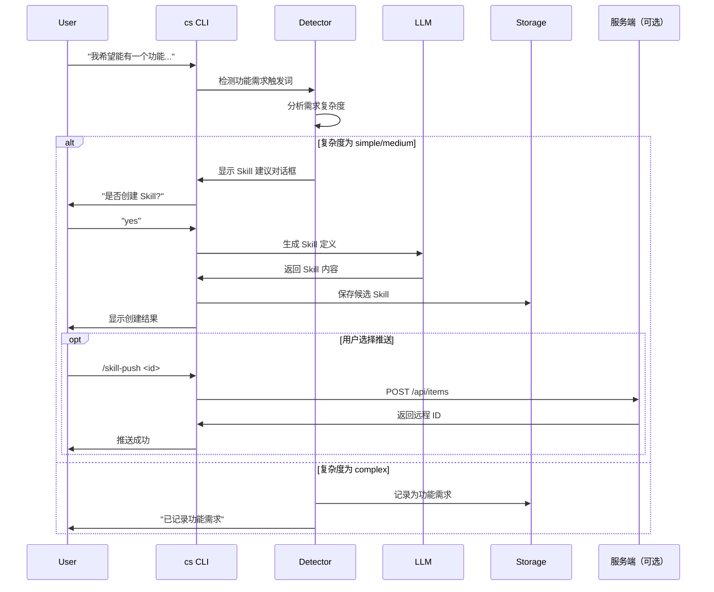

# 客户端 Skill 自我进化机制设计文档

> 基于 self-improving-agent 设计理念，实现客户端优先的 Skill 进化能力

## 1. 设计理念

### 1.1 核心原则

参考 [self-improving-agent](https://clawhub.ai/pskoett/self-improving-agent) 的设计：

1. **客户端优先**：所有进化逻辑在客户端本地执行，服务端仅作为可选的存储协作方
2. **渐进式学习**：临时学习 → Skill 生成 → 服务端共享
3. **用户主导**：只有用户明确批准后，才将 skill 推送到服务端
4. **Hook 驱动**：通过事件钩子自动触发学习检测，不依赖 AI 主动记忆

### 1.2 与服务端的关系

```
┌─────────────────────────────────────────────────────────────────┐
│                         客户端 (cs)                        │
│  ┌─────────────────────────────────────────────────────────────┐ │
│  │                   本地进化闭环                               │ │
│  │  行为采集 → 模式检测 → 学习记录 → Skill 生成                 │ │
│  └─────────────────────────────────────────────────────────────┘ │
│                              │                                   │
│                              │ 用户主动推送                       │
│                              ▼                                   │
│                    ┌─────────────────┐                          │
│                    │  推送确认对话框  │                          │
│                    └────────┬────────┘                          │
└─────────────────────────────┼───────────────────────────────────┘
                              │
                              │ POST /api/items (可选)
                              ▼
                    ┌─────────────────┐
                    │  CoStrict 服务端 │
                    │  (协作存储角色)  │
                    └─────────────────┘
```

---

## 2. 目录结构设计

### 2.1 本地学习目录

在项目或全局 `.costrict/` 目录下新增 `.learnings/` 子目录：

```
.costrict/
├── cs.jsonc
├── agent/
├── command/
├── tool/
├── skill/                    # 现有：本地 skill 存储
│   └── my-skill/
│       └── SKILL.md
├── .learnings/               # 新增：学习记录目录
│   ├── LEARNINGS.md          # 纠正、知识缺口、最佳实践
│   ├── ERRORS.md             # 命令失败、异常记录
│   ├── FEATURE_REQUESTS.md   # 功能需求收集
│   └── CANDIDATES/           # 候选 skill 草稿
│       └── candidate-001/
│           ├── SKILL.md
│           └── metadata.json
```

### 2.2 全局学习目录

```
~/.costrict/
├── .learnings/               # 全局学习记录
│   ├── LEARNINGS.md
│   ├── ERRORS.md
│   └── FEATURE_REQUESTS.md
└── skills/                   # 全局 skills
```

---

## 3. 数据模型

### 3.1 Learning Entry (学习条目)

```typescript
// src/learning/types.ts

export const LearningCategory = z.enum([
  "correction",      // 用户纠正
  "knowledge_gap",   // 知识缺口
  "best_practice",   // 最佳实践
  "error_pattern",   // 错误模式
  "workflow",        // 工作流发现
])

export const LearningEntry = z.object({
  id: z.string().regex(/^LRN-\d{8}-[A-Z0-9]{3}$/),
  category: LearningCategory,
  logged: z.string().datetime(),
  priority: z.enum(["low", "medium", "high", "critical"]),
  status: z.enum(["pending", "in_progress", "resolved", "skill_created"]),
  area: z.enum(["frontend", "backend", "infra", "tests", "docs", "config", "general"]),

  summary: z.string(),
  details: z.string(),
  suggestedAction: z.string().optional(),

  // 元数据
  source: z.enum(["conversation", "error", "user_feedback", "auto_detect"]),
  relatedFiles: z.array(z.string()).optional(),
  tags: z.array(z.string()).optional(),
  seeAlso: z.array(z.string()).optional(),  // 关联其他学习条目 ID

  // 重复模式追踪
  patternKey: z.string().optional(),        // 用于去重的稳定 key
  recurrenceCount: z.number().default(1),
  firstSeen: z.string().datetime().optional(),
  lastSeen: z.string().datetime().optional(),

  // Skill 生成信息
  skillPath: z.string().optional(),         // 如果生成为 skill
})
export type LearningEntry = z.infer<typeof LearningEntry>
```

### 3.2 Error Entry (错误条目)

```typescript
// src/learning/types.ts

export const ErrorEntry = z.object({
  id: z.string().regex(/^ERR-\d{8}-[A-Z0-9]{3}$/),
  logged: z.string().datetime(),
  priority: z.enum(["low", "medium", "high", "critical"]),
  status: z.enum(["pending", "in_progress", "resolved", "wont_fix"]),

  summary: z.string(),
  error: z.string(),                        // 原始错误信息
  context: z.string(),                      // 触发上下文
  suggestedFix: z.string().optional(),

  // 元数据
  reproducible: z.enum(["yes", "no", "unknown"]).default("unknown"),
  relatedFiles: z.array(z.string()).optional(),
  seeAlso: z.array(z.string()).optional(),

  // 解决信息
  resolution: z.object({
    resolvedAt: z.string().datetime(),
    solution: z.string(),
    commitOrPR: z.string().optional(),
  }).optional(),
})
export type ErrorEntry = z.infer<typeof ErrorEntry>
```

### 3.3 Feature Request Entry (功能需求条目)

```typescript
// src/learning/types.ts

export const FeatureRequestEntry = z.object({
  id: z.string().regex(/^FEAT-\d{8}-[A-Z0-9]{3}$/),
  logged: z.string().datetime(),
  priority: z.enum(["low", "medium", "high"]),
  status: z.enum(["pending", "in_progress", "implemented", "wont_implement"]),

  capability: z.string(),                   // 用户想要的能力
  userContext: z.string(),                  // 为什么需要
  complexity: z.enum(["simple", "medium", "complex"]),
  suggestedImplementation: z.string().optional(),

  // 元数据
  frequency: z.enum(["first_time", "recurring"]),
  relatedFeatures: z.array(z.string()).optional(),
})
export type FeatureRequestEntry = z.infer<typeof FeatureRequestEntry>
```

### 3.4 Skill Candidate (候选 Skill)

```typescript
// src/learning/types.ts

export const SkillCandidate = z.object({
  id: z.string().uuid(),
  createdAt: z.string().datetime(),
  status: z.enum(["draft", "review", "approved", "rejected", "pushed"]),

  // Skill 内容
  name: z.string(),
  description: z.string(),
  content: z.string(),                      // SKILL.md 内容

  // 来源追踪
  sourceType: z.enum(["from_learning", "from_error", "from_feature", "manual"]),
  sourceIds: z.array(z.string()),           // 关联的学习/错误/需求 ID

  // 评分
  confidence: z.number().min(0).max(1),     // LLM 评估的置信度
  frequency: z.number(),                    // 模式出现频率

  // 推送状态
  pushStatus: z.enum(["local_only", "pending_push", "pushed", "push_failed"]).default("local_only"),
  pushedAt: z.string().datetime().optional(),
  remoteId: z.string().optional(),          // 服务端返回的 ID
  remoteUrl: z.string().optional(),         // 服务端 URL
})
export type SkillCandidate = z.infer<typeof SkillCandidate>
```

---

## 4. 核心模块设计

### 4.1 模块结构

```
src/learning/
├── index.ts                # 模块导出
├── types.ts                # 类型定义
├── storage.ts              # 本地存储管理
├── detector.ts             # 学习检测器
├── logger.ts               # 日志记录器
├── analyzer.ts             # 模式分析器
├── skill_generator.ts      # Skill 生成器
├── pusher.ts               # 服务端推送器
└── hooks/
    ├── activator.ts        # 任务完成钩子
    ├── error_detector.ts   # 错误检测钩子
    └── session_end.ts      # 会话结束钩子
```

### 4.2 Storage 模块

```typescript
// src/learning/storage.ts

import path from "path"
import { Instance } from "../project/instance"
import { Global } from "../global"
import { Filesystem } from "../util/filesystem"
import { LearningEntry, ErrorEntry, FeatureRequestEntry, SkillCandidate } from "./types"

export namespace LearningStorage {
  // 获取学习目录路径
  export function getLearningsDir(scope: "project" | "global" = "project"): string {
    if (scope === "global") {
      return path.join(Global.Path.home, ".costrict", ".learnings")
    }
    return path.join(Instance.directory, ".costrict", ".learnings")
  }

  // 获取候选 skill 目录
  export function getCandidatesDir(scope: "project" | "global" = "project"): string {
    return path.join(getLearningsDir(scope), "CANDIDATES")
  }

  // 追加学习条目
  export async function appendLearning(
    entry: LearningEntry,
    scope: "project" | "global" = "project"
  ): Promise<void> {
    const filePath = path.join(getLearningsDir(scope), "LEARNINGS.md")
    const content = formatLearningEntry(entry)
    await Filesystem.appendFile(filePath, content + "\n")
  }

  // 追加错误条目
  export async function appendError(
    entry: ErrorEntry,
    scope: "project" | "global" = "project"
  ): Promise<void> {
    const filePath = path.join(getLearningsDir(scope), "ERRORS.md")
    const content = formatErrorEntry(entry)
    await Filesystem.appendFile(filePath, content + "\n")
  }

  // 追加功能需求
  export async function appendFeatureRequest(
    entry: FeatureRequestEntry,
    scope: "project" | "global" = "project"
  ): Promise<void> {
    const filePath = path.join(getLearningsDir(scope), "FEATURE_REQUESTS.md")
    const content = formatFeatureEntry(entry)
    await Filesystem.appendFile(filePath, content + "\n")
  }

  // 保存候选 skill
  export async function saveCandidate(
    candidate: SkillCandidate,
    scope: "project" | "global" = "project"
  ): Promise<string> {
    const dir = path.join(getCandidatesDir(scope), candidate.id)
    await Filesystem.mkdirp(dir)

    // 保存 SKILL.md
    const skillPath = path.join(dir, "SKILL.md")
    const skillContent = `---
name: ${candidate.name}
description: "${candidate.description}"
---

${candidate.content}
`
    await Filesystem.writeFile(skillPath, skillContent)

    // 保存元数据
    const metaPath = path.join(dir, "metadata.json")
    await Filesystem.writeFile(metaPath, JSON.stringify(candidate, null, 2))

    return dir
  }

  // 搜索重复模式
  export async function findSimilarLearning(
    patternKey: string,
    scope: "project" | "global" = "project"
  ): Promise<LearningEntry | undefined> {
    const filePath = path.join(getLearningsDir(scope), "LEARNINGS.md")
    if (!(await Filesystem.exists(filePath))) return undefined

    const content = await Filesystem.readFile(filePath)
    // 解析 markdown，查找匹配的 Pattern-Key
    // ... 实现解析逻辑
  }
}
```

### 4.3 Detector 模块

```typescript
// src/learning/detector.ts

import { Bus } from "../bus"
import { Session } from "../session"

export namespace LearningDetector {
  // 用户纠正触发词
  const CORRECTION_TRIGGERS = [
    "No, that's not right",
    "Actually,",
    "You're wrong",
    "That's outdated",
    "No,",
    "不对",
    "不是这样",
    "应该是",
    "实际上",
  ]

  // 功能需求触发词
  const FEATURE_TRIGGERS = [
    "Can you also",
    "I wish you could",
    "Is there a way to",
    "Why can't you",
    "能不能也",
    "希望可以",
    "为什么不能",
    "需要有个功能",
    "能不能增加",
    "希望支持",
  ]

  // 技能提取信号触发词
  const SKILL_EXTRACTION_TRIGGERS = [
    "Save this as a skill",
    "I keep running into this",
    "This would be useful for other projects",
    "Remember this pattern",
    "Make this a skill",
    "Create a skill for this",
    "保存为技能",
    "记住这个模式",
    "这个很有用",
    "做成技能",
    "创建技能",
    "保存这个工作流",
  ]

  // 检测用户纠正
  export function detectCorrection(userMessage: string): boolean {
    return CORRECTION_TRIGGERS.some(trigger =>
      userMessage.toLowerCase().includes(trigger.toLowerCase())
    )
  }

  // 检测功能需求
  export function detectFeatureRequest(userMessage: string): boolean {
    return FEATURE_TRIGGERS.some(trigger =>
      userMessage.toLowerCase().includes(trigger.toLowerCase())
    )
  }

  // 检测技能提取信号
  export function detectSkillExtractionSignal(userMessage: string): boolean {
    return SKILL_EXTRACTION_TRIGGERS.some(signal =>
      userMessage.toLowerCase().includes(signal.toLowerCase())
    )
  }

  // 订阅会话事件
  export function subscribe() {
    // 监听用户消息
    Bus.subscribe(Session.Event.Message, async (event) => {
      if (event.data.role !== "user") return

      const message = event.data.content

      if (detectCorrection(message)) {
        // 触发纠正学习
        await logCorrectionLearning(message, event.data.sessionId)
      }

      if (detectFeatureRequest(message)) {
        // 触发功能需求记录
        await logFeatureRequest(message, event.data.sessionId)
      }

      if (detectSkillExtractionSignal(message)) {
        // 触发技能提取流程
        await triggerSkillExtraction(event.data.sessionId)
      }
    })
  }
}
```

### 4.4 Skill Generator 模块

```typescript
// src/learning/skill_generator.ts

import { Provider } from "../provider"
import { LearningEntry, ErrorEntry, FeatureRequestEntry, SkillCandidate } from "./types"
import { LearningStorage } from "./storage"

export namespace SkillGenerator {
  // 生成 skill 的条件
  export function shouldGenerateSkill(entries: (LearningEntry | ErrorEntry | FeatureRequestEntry)[]): boolean {
    // 条件1: 至少 2 个相似的条目（重复模式）
    // 条件2: 1 个高优先级且已解决的条目
    // 条件3: 有功能需求且复杂度为 simple 或 medium
    // 条件4: 用户明确要求

    const highPriorityResolved = entries.filter(
      e => e.priority === "high" && e.status === "resolved"
    )
    const recurring = entries.filter(e => {
      if ("recurrenceCount" in e) return e.recurrenceCount >= 2
      return false
    })
    const simpleFeatureRequests = entries.filter(e => {
      if ("complexity" in e) {
        return e.complexity === "simple" || e.complexity === "medium"
      }
      return false
    })

    return highPriorityResolved.length >= 1 || recurring.length >= 1 || simpleFeatureRequests.length >= 1
  }

  // 使用 LLM 生成 skill 内容
  export async function generate(
    sourceEntries: (LearningEntry | ErrorEntry | FeatureRequestEntry)[],
    context: {
      projectName?: string
      projectType?: string
      recentFiles?: string[]
      recentConversation?: string  // 最近的对话上下文（用于需求生成）
    }
  ): Promise<SkillCandidate> {
    const prompt = buildSkillGenerationPrompt(sourceEntries, context)

    const provider = await Provider.get()
    const response = await provider.chat({
      messages: [
        { role: "system", content: SKILL_GENERATION_SYSTEM_PROMPT },
        { role: "user", content: prompt },
      ],
    })

    const skill = parseSkillResponse(response.content)

    return {
      id: generateUUID(),
      createdAt: new Date().toISOString(),
      status: "draft",
      sourceType: determineSourceType(sourceEntries),
      sourceIds: sourceEntries.map(e => e.id),
      confidence: skill.confidence,
      frequency: sourceEntries.length,
      ...skill,
    }
  }

  // 从功能需求生成 skill（快捷方法）
  export async function generateFromFeatureRequest(
    featureRequest: FeatureRequestEntry,
    conversationContext: string
  ): Promise<SkillCandidate> {
    return generate([featureRequest], {
      recentConversation: conversationContext,
    })
  }

  // 将候选 skill 转换为正式 skill
  export async function promoteToSkill(candidateId: string): Promise<string> {
    const candidate = await loadCandidate(candidateId)

    // 创建正式 skill 目录
    const skillDir = path.join(
      Instance.directory,
      ".costrict",
      "skill",
      candidate.name
    )
    await Filesystem.mkdirp(skillDir)

    // 复制 SKILL.md
    const skillPath = path.join(skillDir, "SKILL.md")
    await Filesystem.writeFile(skillPath, formatSkillMarkdown(candidate))

    // 更新候选状态
    await updateCandidateStatus(candidateId, "approved")

    // 更新源条目状态
    for (const sourceId of candidate.sourceIds) {
      await updateEntryStatus(sourceId, "skill_created", {
        skillPath: skillDir,
      })
    }

    return skillDir
  }
}

const SKILL_GENERATION_SYSTEM_PROMPT = `You are a skill extraction expert. Given learning entries, errors, or feature requests, generate a reusable SKILL.md file.

The skill should:
1. Be self-contained and usable without the original context
2. Follow the Agent Skills specification format
3. Include clear triggers for when to use the skill
4. Provide actionable steps and examples

Output format:
\`\`\`json
{
  "name": "skill-name-in-kebab-case",
  "description": "Brief description of what this skill does",
  "content": "Full SKILL.md content in markdown",
  "confidence": 0.85
}
\`\`\`
`

// 构建技能生成提示
function buildSkillGenerationPrompt(
  entries: (LearningEntry | ErrorEntry | FeatureRequestEntry)[],
  context: SkillGenerationContext
): string {
  const entryDescriptions = entries.map(e => {
    if ("capability" in e) {
      // FeatureRequestEntry
      return `
**Feature Request ID**: ${e.id}
**Capability Needed**: ${e.capability}
**User Context**: ${e.userContext}
**Complexity**: ${e.complexity}
**Suggested Implementation**: ${e.suggestedImplementation || "None provided"}
`
    } else if ("error" in e) {
      // ErrorEntry
      return `
**Error ID**: ${e.id}
**Summary**: ${e.summary}
**Error**: ${e.error}
**Context**: ${e.context}
**Suggested Fix**: ${e.suggestedFix || "None provided"}
`
    } else {
      // LearningEntry
      return `
**Learning ID**: ${e.id}
**Category**: ${e.category}
**Summary**: ${e.summary}
**Details**: ${e.details}
**Suggested Action**: ${e.suggestedAction || "None provided"}
`
    }
  }).join("\n---\n")

  return `
Based on the following entries, generate a reusable SKILL.md:

${entryDescriptions}

**Project Context**:
- Project Name: ${context.projectName || "Unknown"}
- Project Type: ${context.projectType || "Unknown"}
- Recent Files: ${context.recentFiles?.join(", ") || "None"}

${context.recentConversation ? `
**Recent Conversation Context**:
${context.recentConversation}
` : ""}

Generate a skill that:
1. Addresses the user's stated capability needs
2. Is practical and actionable
3. Follows the Agent Skills specification format
4. Includes clear triggers and examples
`
}
```

### 4.5 Pusher 模块（可选的服务端推送）

```typescript
// src/learning/pusher.ts

import { Auth } from "../auth"
import { Config } from "../config/config"
import { SkillCandidate } from "./types"
import { Bus } from "../bus"
import { Session } from "../session"

export namespace SkillPusher {
  // 检查是否配置了服务端
  export async function isServerConfigured(): Promise<boolean> {
    const config = await Config.get()
    return !!config.server?.url
  }

  // 推送 skill 到服务端
  export async function pushToServer(candidateId: string): Promise<{
    success: boolean
    remoteId?: string
    remoteUrl?: string
    error?: string
  }> {
    const candidate = await loadCandidate(candidateId)

    // 检查认证
    const auth = await Auth.get()
    if (!auth.authenticated) {
      return { success: false, error: "Not authenticated" }
    }

    const config = await Config.get()
    const serverUrl = config.server?.url

    if (!serverUrl) {
      return { success: false, error: "Server not configured" }
    }

    try {
      // 调用服务端 API
      const response = await fetch(`${serverUrl}/api/items`, {
        method: "POST",
        headers: {
          "Content-Type": "application/json",
          "Authorization": `Bearer ${auth.token}`,
        },
        body: JSON.stringify({
          name: candidate.name,
          slug: candidate.name,
          description: candidate.description,
          item_type: "skill",
          content: candidate.content,
          visibility: "private", // 默认私有
          metadata: {
            source: "client_generated",
            sourceIds: candidate.sourceIds,
            confidence: candidate.confidence,
          },
        }),
      })

      if (!response.ok) {
        throw new Error(`Server returned ${response.status}`)
      }

      const data = await response.json()

      // 更新候选状态
      await updateCandidateStatus(candidateId, "pushed", {
        pushedAt: new Date().toISOString(),
        remoteId: data.id,
        remoteUrl: `${serverUrl}/skills/${data.id}`,
      })

      return {
        success: true,
        remoteId: data.id,
        remoteUrl: `${serverUrl}/skills/${data.id}`,
      }
    } catch (error) {
      await updateCandidateStatus(candidateId, "push_failed")
      return { success: false, error: String(error) }
    }
  }

  // 显示推送确认对话框
  export async function showPushConfirmation(candidateId: string): Promise<boolean> {
    const candidate = await loadCandidate(candidateId)

    // 通过 Bus 发送事件，让前端显示确认对话框
    return new Promise((resolve) => {
      Bus.publish(Session.Event.SkillPushRequest, {
        candidateId,
        candidate,
        onConfirm: () => resolve(true),
        onCancel: () => resolve(false),
      })
    })
  }
}
```

---

## 5. Hook 集成

### 5.1 任务完成 Hook

```typescript
// src/learning/hooks/activator.ts

import { Bus } from "../../bus"
import { Session } from "../../session"

export namespace ActivatorHook {
  export function register() {
    // 在任务完成时触发学习评估
    Bus.subscribe(Session.Event.TaskComplete, async (event) => {
      const { sessionId, taskSummary } = event.data

      // 评估是否有可提取的知识
      const hasLearning = await evaluateLearning(sessionId, taskSummary)

      if (hasLearning) {
        // 注入提醒
        Bus.publish(Session.Event.SystemMessage, {
          sessionId,
          content: `<learning-reminder>
Task completed. Consider evaluating if any knowledge should be captured:
- Non-obvious solution discovered?
- Workaround for unexpected behavior?
- Project-specific pattern learned?
- Error required debugging to resolve?

If yes: Use /skills-capture to log this learning.
If high-value (recurring, broadly applicable): Consider skill extraction.
</learning-reminder>`,
        })
      }
    })
  }
}
```

### 5.2 错误检测 Hook

```typescript
// src/learning/hooks/error_detector.ts

import { Bus } from "../../bus"
import { Session } from "../../session"

export namespace ErrorDetectorHook {
  const ERROR_PATTERNS = [
    "error:",
    "Error:",
    "ERROR:",
    "failed",
    "FAILED",
    "command not found",
    "No such file",
    "Permission denied",
    "fatal:",
    "Exception",
    "Traceback",
    "npm ERR!",
    "ModuleNotFoundError",
    "SyntaxError",
    "TypeError",
    "exit code",
    "non-zero",
  ]

  export function register() {
    // 监听 Bash 工具输出
    Bus.subscribe(Session.Event.ToolOutput, async (event) => {
      if (event.data.toolName !== "Bash") return

      const output = event.data.output

      // 检测错误模式
      const hasError = ERROR_PATTERNS.some(pattern =>
        output.toLowerCase().includes(pattern.toLowerCase())
      )

      if (hasError) {
        Bus.publish(Session.Event.SystemMessage, {
          sessionId: event.data.sessionId,
          content: `<error-detected>
A command error was detected. Consider logging this to .costrict/.learnings/ERRORS.md if:
- The error was unexpected or non-obvious
- It required investigation to resolve
- It might recur in similar contexts
- The solution could benefit future sessions

Use /error-log to capture this.
</error-detected>`,
        })
      }
    })
  }
}
```

### 5.3 会话结束 Hook

```typescript
// src/learning/hooks/session_end.ts

import { Bus } from "../../bus"
import { Session } from "../../session"
import { LearningStorage } from "../storage"

export namespace SessionEndHook {
  export function register() {
    Bus.subscribe(Session.Event.End, async (event) => {
      const { sessionId } = event.data

      // 获取会话中的待处理学习
      const pendingLearnings = await getPendingLearnings(sessionId)
      const pendingCandidates = await getPendingCandidates(sessionId)

      if (pendingLearnings.length > 0 || pendingCandidates.length > 0) {
        Bus.publish(Session.Event.SystemMessage, {
          sessionId,
          content: `<session-summary>
Session ended with pending items:
- ${pendingLearnings.length} learning(s) awaiting review
- ${pendingCandidates.length} skill candidate(s) awaiting approval

Review them with:
- /learning-review - Review pending learnings
- /skill-candidates - Review skill candidates
</session-summary>`,
        })
      }
    })
  }
}
```

---

### 5.4 需求生成 Skill Hook

当用户表达功能需求时，系统可以自动检测并引导用户生成 Skill。

```typescript
// src/learning/hooks/feature_skill_hook.ts

import { Bus } from "../../bus"
import { Session } from "../../session"
import { SkillGenerator } from "../skill_generator"
import { LearningStorage } from "../storage"

export namespace FeatureSkillHook {
  export function register() {
    // 监听功能需求检测事件
    Bus.subscribe(Session.Event.FeatureRequestDetected, async (event) => {
      const { message, sessionId, conversationContext } = event.data

      // 创建功能需求条目
      const featureEntry = await LearningStorage.appendFeatureRequest({
        capability: extractCapability(message),
        userContext: extractUserContext(message),
        complexity: await estimateComplexity(message, conversationContext),
        frequency: "first_time",
      })

      // 检查是否满足自动生成条件
      if (featureEntry.complexity === "simple" || featureEntry.complexity === "medium") {
        // 发送系统消息，询问用户是否要生成 Skill
        Bus.publish(Session.Event.SystemMessage, {
          sessionId,
          content: `<skill-suggestion>
I noticed you mentioned needing a new capability:
"${extractCapability(message)}"

Would you like me to create a Skill for this?
- Reply "yes" or "create skill" to generate a draft skill
- Reply "no" to just log this as a feature request

This will help automate this task in future sessions.
</skill-suggestion>`,
          metadata: {
            featureEntryId: featureEntry.id,
            type: "skill_suggestion",
          },
        })
      }
    })

    // 监听用户对 Skill 建议的响应
    Bus.subscribe(Session.Event.Message, async (event) => {
      if (event.data.role !== "user") return

      const lastSystemMessage = await getLastSystemMessage(event.data.sessionId)
      if (lastSystemMessage?.metadata?.type !== "skill_suggestion") return

      const userResponse = event.data.content.toLowerCase()
      if (userResponse.includes("yes") || userResponse.includes("create skill") ||
          userResponse.includes("好的") || userResponse.includes("创建技能")) {
        // 触发 Skill 生成
        const featureEntry = await LearningStorage.getFeatureEntry(
          lastSystemMessage.metadata.featureEntryId
        )
        const conversationContext = await getConversationContext(event.data.sessionId)

        const candidate = await SkillGenerator.generateFromFeatureRequest(
          featureEntry,
          conversationContext
        )

        // 保存候选 Skill
        await LearningStorage.saveCandidate(candidate)

        Bus.publish(Session.Event.SystemMessage, {
          sessionId: event.data.sessionId,
          content: `<skill-created>
I've created a draft skill based on your request:

**Name**: ${candidate.name}
**Description**: ${candidate.description}
**Confidence**: ${(candidate.confidence * 100).toFixed(0)}%

The skill is saved as a draft in:
\`.costrict/.learnings/CANDIDATES/${candidate.id}/

Review and approve it with:
\`cs skill approve ${candidate.id}\`
</skill-created>`,
        })
      }
    })
  }

  // 从消息中提取能力描述
  function extractCapability(message: string): string {
    // 移除触发词前缀，提取核心需求
    const triggers = ["Can you also", "I wish you could", "Is there a way to",
                      "能不能也", "希望可以", "需要有个功能"]
    let capability = message
    for (const trigger of triggers) {
      capability = capability.replace(new RegExp(trigger, "i"), "")
    }
    return capability.trim()
  }

  // 从消息中提取用户上下文
  function extractUserContext(message: string): string {
    // 返回完整消息作为上下文
    return message
  }

  // 使用 LLM 评估复杂度
  async function estimateComplexity(
    message: string,
    context: string
  ): Promise<"simple" | "medium" | "complex"> {
    const provider = await Provider.get()
    const response = await provider.chat({
      messages: [
        {
          role: "system",
          content: `Estimate the complexity of implementing the requested capability.
Return only one of: "simple", "medium", or "complex"

simple: Single step or straightforward automation
medium: Multiple steps but well-defined workflow
complex: Requires significant logic, multiple integrations, or unclear implementation`,
        },
        { role: "user", content: `Request: ${message}\n\nContext: ${context}` },
      ],
    })

    const result = response.content.toLowerCase().trim()
    if (["simple", "medium", "complex"].includes(result)) {
      return result as "simple" | "medium" | "complex"
    }
    return "medium"
  }
}
```

---

## 6. Skill 生成完整流程

### 6.1 流程概览

```
┌───────────────────────────────────────────────────────────────────────────────────────┐
│                              Skill 生成来源                                            │
├───────────────────────────────────────────────────────────────────────────────────────┤
│                                                                                       │
│  ┌────────────┐  ┌────────────┐  ┌────────────┐  ┌────────────┐                    │
│  │  会话捕获  │  │  规则触发  │  │  错误模式  │  │  手动创建  │                    │
│  │  /skills-  │  │ 关键词检测 │  │  命令失败  │  │ cs learning │                    │
│  │  capture   │  │            │  │            │  │  generate  │                    │
│  └─────┬──────┘  └─────┬──────┘  └─────┬──────┘  └─────┬──────┘                    │
│        │               │               │               │                           │
│        ▼               ▼               ▼               ▼                           │
│  ┌─────────────────────────────────────────────────────────────────────────────┐     │
│  │                      Learning Entry / Feature Request                       │     │
│  │                      ID: LRN-* / FEAT-* / ERR-*                             │     │
│  │                      存储于 .costrict/.learnings/                           │     │
│  └───────────────────────────────────┬─────────────────────────────────────────┘     │
│                                      │                                               │
│                                      │ cs learning generate <id>                     │
│                                      ▼                                               │
│  ┌─────────────────────────────────────────────────────────────────────────────┐     │
│  │                      Skill Candidate (draft)                                 │     │
│  │                      ID: UUID 格式                                           │     │
│  │                      存储于 .costrict/.learnings/CANDIDATES/                  │     │
│  └───────────────────────────────────┬─────────────────────────────────────────┘     │
│                                      │                                               │
│                    ┌─────────────────┼─────────────────┐                             │
│                    ▼                 ▼                 ▼                             │
│             ┌──────────┐      ┌──────────┐      ┌──────────┐                         │
│             │  approve │      │  reject  │      │   push   │                         │
│             └────┬─────┘      └────┬─────┘      └────┬─────┘                         │
│                  │                 │                 │                               │
│                  ▼                 ▼                 ▼                               │
│  ┌───────────────────────┐  ┌───────────────┐  ┌───────────────┐                    │
│  │     Formal Skill      │  │   Rejected    │  │  Server Sync  │                    │
│  │  .costrict/skill/     │  │   (deleted)   │  │    (可选)     │                    │
│  │  <name>/SKILL.md      │  │               │  │               │                    │
│  └───────────────────────┘  └───────────────┘  └───────────────┘                    │
│                                                                                       │
└───────────────────────────────────────────────────────────────────────────────────────┘

来源说明：
  1. 会话捕获 (/skills-capture)    - 从对话中提取知识点
  2. 规则触发 (关键词检测)         - 自动检测纠正/工作流触发词
  3. 错误模式 (命令失败)           - 自动检测错误输出
  4. Feature Request               - 功能需求自动评估后建议生成
  5. 手动创建 (cs learning generate) - 从已有 Learning 生成
     - `cs learning generate`          - 批量生成（跳过已转换的）
     - `cs learning generate <id>`     - 单个生成
```

### 6.2 生成来源详解

#### 来源 1: 会话捕获 (`/skills-capture`)

从当前对话中手动提取学习内容。

```bash
# 在对话中使用
/skills-capture
```

**触发条件：**
- 用户主动调用命令
- 对话中有可提取的知识点

**生成的 Learning Category：**
- `correction` - 用户纠正了 AI 的回答
- `knowledge_gap` - 发现了知识缺口
- `best_practice` - 项目特定的最佳实践
- `error_pattern` - 错误模式及解决方案
- `workflow` - 可复用的工作流程

**示例：**
```
用户: 刚才解决的那个 TypeScript 类型错误，是因为泛型约束不完整。应该这样写...

AI: 我已捕获这个学习，ID: LRN-20260316-001
    Category: best_practice
    Status: pending
```

---

#### 来源 2: 规则触发（自动检测）

系统自动检测用户消息中的特定关键词，自动创建 Learning。

**触发关键词：**

| Category | 触发词（中文） | 触发词（英文） |
|----------|---------------|---------------|
| `correction` | 不对、应该是、错了、不是这样、实际上 | No, Actually, You're wrong, That's outdated |
| `workflow` | 保存为技能、记住这个模式、这个很有用、做成技能 | Save as skill, Remember this pattern, Make this a skill |
| `feature_request` | 希望可以、能不能也、需要有个功能、希望支持 | Can you also, I wish you could, Is there a way to |

**示例：**
```
用户: 不对，应该用 fetch 而不是 axios，这个项目不用 axios

AI: [自动检测到纠正] 已创建 Learning: LRN-20260316-002
    Category: correction
    Summary: 项目使用 fetch 而非 axios
```

---

#### 来源 3: 错误模式（命令失败检测）

当工具执行失败时，系统自动检测错误模式并创建 Learning。

**检测的错误模式：**
```
error:, Error:, ERROR:, failed, FAILED, command not found,
No such file, Permission denied, fatal:, Exception, Traceback,
npm ERR!, ModuleNotFoundError, SyntaxError, TypeError, exit code
```

**示例：**
```
[执行] bun run typecheck
[错误] Type 'string | undefined' is not assignable to type 'string'

AI: [自动检测到错误] 已创建 Learning: LRN-20260316-003
    Category: error_pattern
    Summary: TypeScript 类型错误：string | undefined 不能赋值给 string
```

---

#### 来源 4: 手动创建 Skill 候选

直接从 Learning 生成 Skill 候选，或手动创建。

```bash
# 从 Learning 生成
cs learning generate LRN-20260316-001

# 输出
Generating skill candidate from LRN-20260316-001...
Candidate ID: 550e8400-e29b-41d4-a716-446655440000
Name: use-fetch-instead-of-axios
Confidence: 0.85

Review and approve with: cs learning approve 550e8400-e29b-41d4-a716-446655440000
```

---

#### 来源 5: 从 Feature Request 生成

用户表达的功能需求会被记录为 `FeatureRequestEntry`，可以从中生成 Skill。

```bash
# 查看功能需求
cs learning list --category feature

# 从功能需求生成 Skill
cs learning generate FEAT-20260316-001
```

### 6.3 状态流转

#### Learning 状态流转

```
┌─────────┐     generate     ┌──────────────┐
│ pending │ ───────────────► │ skill_created│  (生成正式 Skill)
└────┬────┘                  └──────────────┘
     │
     │ resolve
     ▼
┌──────────┐
│ resolved │  (问题已解决)
└──────────┘
```

| Status | 说明 |
|--------|------|
| `pending` | 待处理，新创建的默认状态 |
| `in_progress` | 处理中 |
| `resolved` | 已解决 |
| `skill_created` | 已生成正式 Skill |

#### Skill Candidate 状态流转

```
┌────────┐     approve      ┌──────────┐     push       ┌────────┐
│ draft  │ ───────────────► │ approved │ ─────────────► │ pushed │
└────┬───┘                 └──────────┘                 └────────┘
     │
     │ reject
     ▼
┌──────────┐
│ rejected │
└──────────┘
```

| Status | 说明 |
|--------|------|
| `draft` | 草稿，待审核 |
| `review` | 审核中 |
| `approved` | 已批准，成为正式 Skill |
| `rejected` | 已拒绝 |
| `pushed` | 已推送到服务端 |

### 6.4 完整操作流程

#### 场景 1: 从对话中提取学习并生成 Skill

```bash
# Step 1: 在对话中捕获学习
/skills-capture

# Step 2: 查看学习列表
cs learning list
# 输出:
# ID                  Category       Priority  Status      Summary
# ─────────────────────────────────────────────────────────────────
# LRN-20260316-001    best_practice  high      pending     项目使用 pnpm 而非 npm

# Step 3: 从学习生成 Skill 候选
cs learning generate LRN-20260316-001
# 或者批量生成所有待处理的 learning
# cs learning generate

# 输出:
# Generated candidate: 550e8400-e29b-41d4-a716-446655440000
# Name: use-pnpm-package-manager
# Review with: cs learning candidates

# Step 4: 查看候选列表
cs learning candidates
# 输出:
# ID                                    Name                        Status  Confidence
# ──────────────────────────────────────────────────────────────────────────────────
# 550e8400-e29b-41d4-a716-446655440000  use-pnpm-package-manager    draft   0.85

# Step 5: 批准候选（生成正式 Skill）
cs learning approve 550e8400-e29b-41d4-a716-446655440000
# 输出:
# Skill approved and created at: .costrict/skill/use-pnpm-package-manager/SKILL.md

# Step 6: (可选) 推送到服务端
cs learning push 550e8400-e29b-41d4-a716-446655440000
```

#### 场景 2: 触发式自动学习

```bash
# 用户在对话中说:
# "不对，这个项目用的是 PostgreSQL，不是 MySQL"

# 系统自动创建 Learning
# [自动] Created: LRN-20260316-005 (correction)

# 后续步骤同场景 1
cs learning generate LRN-20260316-005
cs learning approve <candidate-id>
```

#### 场景 3: 错误模式自动捕获

```bash
# 命令执行失败
bun run build
# error: Cannot find module '@/config'

# 系统自动创建 Learning
# [自动] Created: LRN-20260316-006 (error_pattern)

# 查看并处理
cs learning show LRN-20260316-006
cs learning generate LRN-20260316-006  # 生成 Skill 候选
```

### 6.5 CLI 命令速查

```bash
# ==================== Learning 管理 ====================
cs learning list                    # 列出所有学习条目
cs learning list --status pending   # 按状态筛选
cs learning list --category error   # 按类别筛选
cs learning show <id>               # 查看详情
cs learning generate                # 批量生成 Skill 候选（跳过已转换）
cs learning generate <id>           # 从指定学习条目生成 Skill 候选

# ==================== Skill Candidate 管理 ====================
cs learning candidates              # 列出所有候选
cs learning approve <candidate-id>  # 批准候选（生成正式 Skill）
cs learning reject <candidate-id>   # 拒绝候选
cs learning push <candidate-id>     # 推送到服务端

# ==================== 对话中快捷命令 ====================
/skills-capture                     # 从当前对话提取学习
```

### 6.6 文件存储位置

```
.costrict/
├── .learnings/
│   ├── LEARNINGS.md              # 学习条目 (LRN-*)
│   ├── ERRORS.md                 # 错误记录 (ERR-*)
│   ├── FEATURE_REQUESTS.md       # 功能需求 (FEAT-*)
│   └── CANDIDATES/               # Skill 候选
│       └── <uuid>/
│           ├── SKILL.md          # Skill 内容
│           └── metadata.json     # 元数据
│
└── skill/                        # 正式 Skills
    └── <skill-name>/
        └── SKILL.md              # 最终可用的 Skill
```

### 6.7 ID 格式说明

| 类型 | 格式 | 示例 |
|------|------|------|
| Learning ID | `LRN-YYYYMMDD-XXX` | `LRN-20260316-001` |
| Error ID | `ERR-YYYYMMDD-XXX` | `ERR-20260316-005` |
| Feature ID | `FEAT-YYYYMMDD-XXX` | `FEAT-20260316-002` |
| Candidate ID | UUID | `550e8400-e29b-41d4-a716-446655440000` |

**重要：**
- `cs learning generate [<id>]` - 可选 Learning ID，不传则批量生成
- `cs learning approve` 和 `cs learning reject` 使用 **Candidate ID** (UUID)

---

## 7. CLI 命令

### 7.1 新增命令

```bash
# 学习管理
cs learning list              # 列出所有学习条目
cs learning show <id>         # 查看学习详情
cs learning generate          # 批量生成 Skill 候选（跳过已转换）
cs learning generate <id>     # 从指定学习条目生成 Skill 候选

# Skill 候选管理
cs learning candidates        # 列出候选 skills
cs learning approve <id>      # 批准候选（转为正式 skill）
cs learning reject <id>       # 拒绝候选
cs learning push <id>         # 推送到服务端

# 快捷命令（对话中使用）
/skills-capture                      # 从当前对话提取学习
/skill-generate                     # 从当前对话上下文生成 Skill
/error-log                          # 记录错误
/feature-request                    # 记录功能需求
/learning-review                    # 审查待处理学习
```

> **Note**: 错误管理和功能需求管理在学习条目中统一存储，通过 `cs learning list` 查看。

---

## 8. 配置扩展

### 8.1 cs.jsonc 扩展

```jsonc
{
  // 现有配置...

  // 新增：学习系统配置
  "learning": {
    // 启用学习系统
    "enabled": true,

    // 自动检测触发
    "autoDetect": {
      "corrections": true,      // 检测用户纠正
      "errors": true,           // 检测错误
      "featureRequests": true,  // 检测功能需求
    },

    // Skill 生成阈值
    "skillGeneration": {
      "recurrenceThreshold": 3,  // 重复出现次数
      "priorityThreshold": "high" // 优先级阈值
    },

    // 服务端推送配置（可选）
    "push": {
      "enabled": false,          // 是否启用推送
      "autoPush": false,         // 是否自动推送
      "serverUrl": "",           // 服务端 URL
      "visibility": "private"    // 默认可见性
    }
  }
}
```

---

## 9. 实现路线图

### Phase 1: 基础设施

- [ ] 创建 `src/learning/` 模块结构
- [ ] 实现类型定义 `types.ts`
- [ ] 实现本地存储 `storage.ts`
- [ ] 初始化 `.learnings/` 目录结构

### Phase 2: 检测与记录

- [ ] 实现学习检测器 `detector.ts`
- [ ] 实现日志记录器 `logger.ts`
- [ ] 集成 Hook 系统
- [ ] 添加 CLI 命令

### Phase 3: 分析与 Skill 生成

- [ ] 实现模式分析器 `analyzer.ts`
- [ ] 实现 Skill 生成器 `skill_generator.ts`
- [ ] 集成 LLM 生成 skill

### Phase 4: 服务端集成（可选）

- [ ] 实现推送器 `pusher.ts`
- [ ] 添加推送确认 UI
- [ ] 处理服务端响应

### Phase 5: 测试与文档

- [ ] 单元测试
- [ ] 集成测试
- [ ] 用户文档

---

## 10. 需求生成 Skill 功能场景

### 10.1 场景概述

用户在对话中表达功能需求时，系统自动检测并引导生成可复用的 Skill。

**示例对话：**

```
User: 我希望能有一个功能，自动下载每周的报表，然后解析数据，统计汇总后发送邮件给团队。

AI: 我注意到您描述了一个可能重复使用的工作流。是否要将此保存为 Skill，以便将来可以自动执行？
      - Reply "yes" to create skill
      - Reply "no" to just log this as a feature request

User: yes

AI: 正在生成 Skill...

      **Skill Created**: weekly-report-automation

      Description: Automatically download, parse, and email weekly reports

      The skill has been saved as a draft. You can:
      - Review and approve it with: /skill-candidates
      - Edit it manually at: .costrict/.learnings/CANDIDATES/xxx/SKILL.md
```

### 10.2 完整流程图



### 10.3 生成条件

| 条件 | 触发行为 | 说明 |
|------|----------|------|
| `complexity === "simple"` | 直接建议生成 Skill | 单步骤或简单自动化 |
| `complexity === "medium"` | 建议生成 Skill | 多步骤但流程清晰 |
| `complexity === "complex"` | 仅记录需求 | 需要复杂逻辑或多系统集成 |

### 10.4 与服务端协作

生成的 Skill 可以选择推送到服务端，进入团队共享的能力市场：

```typescript
// 推送流程
const pushResult = await SkillPusher.pushToServer(candidateId)

if (pushResult.success) {
  console.log(`Skill published to: ${pushResult.remoteUrl}`)
  // 服务端将自动：
  // 1. 创建向量索引（用于搜索）
  // 2. 关联到用户的组织
  // 3. 设置可见性（默认 private）
}
```

**推送确认 UI 示例：**

```
┌─────────────────────────────────────────────────────────┐
│  Push Skill to Server?                                  │
├─────────────────────────────────────────────────────────┤
│                                                         │
│  Skill: weekly-report-automation                        │
│  Visibility: [Private ▼]  (only visible to your team)   │
│                                                         │
│  [Cancel]                        [Push to Server]       │
└─────────────────────────────────────────────────────────┘
```

---

## 11. 与现有系统的集成

### 11.1 与 Skill 系统集成

```typescript
// 在 src/skill/skill.ts 中添加候选 skill 扫描

// 扫描候选 skill 目录
const candidatesDir = path.join(configDir, ".learnings", "CANDIDATES")
const candidateMatches = await Glob.scan("**/SKILL.md", {
  cwd: candidatesDir,
  absolute: true,
})

// 将候选 skill 标记为 "draft" 状态
for (const match of candidateMatches) {
  const metaPath = path.join(path.dirname(match), "metadata.json")
  if (await Filesystem.exists(metaPath)) {
    const meta = JSON.parse(await Filesystem.readFile(metaPath))
    if (meta.status === "approved") {
      // 只有 approved 的候选才作为正式 skill 加载
      await addSkill(match)
    }
  }
}
```

---

## 12. 安全与隐私

1. **本地优先**：所有学习数据默认存储在本地，不上传到服务端
2. **用户控制**：推送前必须用户确认
3. **敏感信息过滤**：在记录前自动过滤潜在的敏感信息（密钥、密码等）
4. **可选禁用**：用户可以在配置中完全禁用学习系统

---

## 附录 A：Markdown 格式模板

### LEARNINGS.md 模板

```markdown
# Learnings Log

Captured learnings, corrections, and discoveries. Review before major tasks.

---

## [LRN-20260312-001] correction

**Logged**: 2026-03-12T10:00:00Z
**Priority**: high
**Status**: pending
**Area**: backend

### Summary
Project uses pnpm workspaces, not npm

### Details
Attempted `npm install` but failed. Lock file is `pnpm-lock.yaml`.
Must use `pnpm install` for dependency management.

### Suggested Action
Update documentation to mention pnpm requirement

### Metadata
- Source: user_feedback
- Related Files: package.json
- Tags: build, dependencies
- Pattern-Key: package_manager.mismatch
- Recurrence-Count: 1
- First-Seen: 2026-03-12
- Last-Seen: 2026-03-12

---
```

### ERRORS.md 模板

```markdown
# Errors Log

Command failures and exceptions. Log errors for pattern detection.

---

## [ERR-20260312-001] bun_install

**Logged**: 2026-03-12T09:30:00Z
**Priority**: high
**Status**: pending

### Summary
Bun install fails with lockfile version mismatch

### Error
```
error: lockfile version mismatch (expected 0, got 1)
```

### Context
- Command: `bun install`
- Environment: Bun 1.2.0
- Project uses bun.lock generated by newer version

### Suggested Fix
Upgrade Bun to match lockfile version: `bun upgrade`

### Metadata
- Reproducible: yes
- Related Files: bun.lock
- See Also: ERR-20260310-002

---
```
